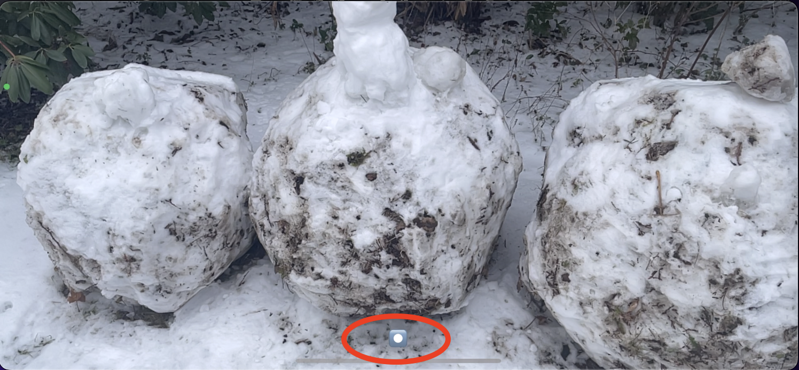
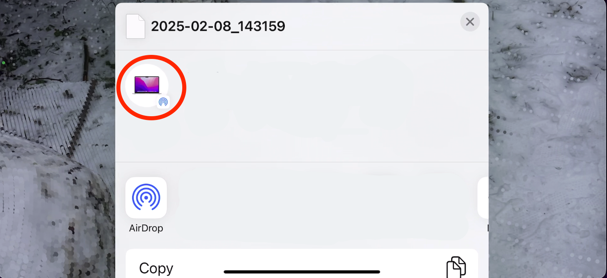

# Save iOS ARFrame and Point Cloud

<p align="center">
  
</p>

This project improves the usability of the [sample code](https://developer.apple.com/documentation/arkit/environmental_analysis/displaying_a_point_cloud_using_scene_depth) from WWDC20 session [10611: Explore ARKit 4](https://developer.apple.com/wwdc20/10611/). Note that the sample code is also on the `original` branch and the original code from WWDC20 can be checked out at the first commit. The original project places points in the real-world using the scene's depth data to visualize the shape of the physical environment. 

## Usability functions

This project adds the following functions:

* Add a button to make recordings available

<p align="left">
  
</p>

* Add a button to take a shot from a differenct angle

<p align="left">
  
  
  
</p>

* Add a buttun to stop recordings and share point clouds

<p align="left">
  
</p>

* Save [ARFrame](https://developer.apple.com/documentation/arkit/arframe) raw data asynchronously at a chosen rate when recording. The selected data include

  ```swift
  // custom struct for pulling necessary data from arframes
  struct ARFrameDataPack {
      var timestamp: Double
      var cameraTransform: simd_float4x4
      var cameraEulerAngles: simd_float3
      var depthMap: CVPixelBuffer
      var smoothedDepthMap: CVPixelBuffer
      var confidenceMap: CVPixelBuffer
      var capturedImage: CVPixelBuffer
      var localToWorld: simd_float4x4
      var cameraIntrinsicsInversed: simd_float3x3
  }
  ```
    
  The captured images are stored in `jpeg` format and others are coded into `json` files of which the format is specified as below.
  
  ```swift
  struct DataPack: Codable {
      var timestamp: Double
      var cameraTransform: simd_float4x4 // The position and orientation of the camera in world coordinate space.
      var cameraEulerAngles: simd_float3 // The orientation of the camera, expressed as roll, pitch, and yaw values.
      var depthMap: [[Float32]]
      var smoothedDepthMap: [[Float32]]
      var confidenceMap: [[UInt8]]
      var localToWorld: simd_float4x4
      var cameraIntrinsicsInversed: simd_float3x3
  }
  ```
  
  They can be retrieved in Finder with USB connection. Those raw data make it possible to leverage photogrammetry techniques for various tasks.

<p align="center">
  
</p>

